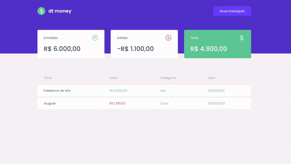

<div align="center">

</div>
<div align="center">

<p>    </p>

</div>

## - Objective ♟ 
The objective of this app was to create a site capable of helping you with the finances. The site is responsable to calculate you witdraws and your incomes, so you can keep your financial life organized, you can see it [running here](https://dtmoney-rocketseat.netlify.app/)
 



## - Technologies 🚀️
Project created on Rocketseat course using React. I also used miragejs to create a fake api so i could consume an api. for consuming the api i decided to use axios you chan check the app


## - Future udpates ⛏
```
⬜️ Delete transaction
⬜️ Edit transaction
```